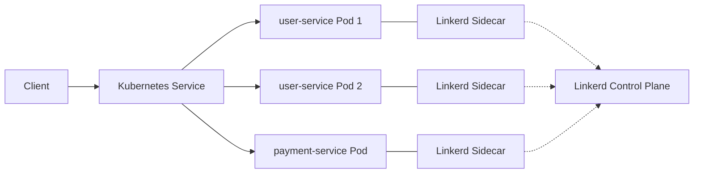

# 📦 Microservice with Service Discovery & Service Mesh (Linkerd)

## 📌 Overview

#This project demonstrates a **microservice-based architecture** with:

- Multiple service instances
- Service discovery using Kubernetes Services
- Client-side interaction using service names
- Service mesh integration using **Linkerd**

The system shows how microservices can dynamically discover each other, balance traffic, and remain resilient under failures.

---

## 🎯 Objectives

- Run **multiple instances** of a service
- Enable **service discovery**
- Demonstrate **load balancing**
- Integrate **service mesh (Linkerd)**
- Show **observability and fault tolerance**

---

## 🏗️ Architecture



### 🔍 Explanation

- **Client (curl pod)** sends requests using service names
- **Kubernetes Service** handles service discovery
- **Multiple pods** provide scalability
- **Linkerd sidecars** intercept traffic and provide:
  - Load balancing
  - Observability
  - Reliability

---

## 🛠️ Tech Stack

- Kubernetes (Docker Desktop / Minikube)
- Python (Flask)
- Docker
- Linkerd (Service Mesh)
- curl (for testing)

---

## 📁 Project Structure

```
.
├── example_service.py
├── app.yaml
├── Dockerfile
├── requirements.txt
└── README.md
```

---

## ⚙️ Setup Instructions

### 1. Start Kubernetes

Enable Kubernetes in Docker Desktop or run:

```bash
minikube start
```

---

### 2. Install Linkerd

```bash
linkerd install --crds | kubectl apply -f -
linkerd install --set proxyInit.runAsRoot=true | kubectl apply -f -
linkerd check
```

Install dashboard:

```bash
linkerd viz install | kubectl apply -f -
linkerd viz check
```

---

### 3. Build Docker Image

```bash
docker build -t service-registry:latest .
```

---

### 4. Deploy Application

```bash
kubectl apply -f app.yaml
kubectl get pods -n demo
```

---

### 5. Create Test Client (curl pod)

```bash
kubectl -n demo run curl \
  --image=curlimages/curl \
  --restart=Never \
  --overrides='{"metadata":{"annotations":{"linkerd.io/inject":"disabled"}}}' \
  --command -- sleep 3600
```

Access it:

```bash
kubectl -n demo exec -it pod/curl -c curl -- sh
```

---

## 🧪 Testing

### 🔹 Service Discovery

Inside the curl pod, test service discovery:

```bash
curl user-service
curl payment-service
```

---

### 🔹 Load Balancing

Run multiple requests to see load balancing:

```bash
while true; do curl user-service; echo; sleep 1; done
```

👉 Output will show different pod names → proves load balancing

---

### 🔹 Observability

```bash
linkerd stat deploy -n demo
```

---

### 🔹 Live Traffic Monitoring

```bash
linkerd viz tap deploy/user-service -n demo
```

---

### 🔹 Failure Handling

Delete one pod:

```bash
kubectl delete pod -n demo <pod-name>
```

👉 Service continues working → fault tolerance

---

## 📊 Sample Output

```json
{
  "service": "user-service",
  "pod": "user-service-abc123",
  "port": 8001
}
```

---

## 🚀 Key Features

### ✅ Service Discovery

Services communicate using names (`user-service`) instead of IPs.

### ✅ Load Balancing

Traffic is distributed across multiple service instances.

### ✅ Service Mesh (Linkerd)

- Automatic proxy injection
- Transparent communication
- No code changes required

### ✅ Observability

- Request rate
- Latency
- Success rate

### ✅ Fault Tolerance

System continues working even when a pod fails.

---

## 🔁 Without vs With Service Mesh

| Feature           | Without Mesh | With Linkerd |
| ----------------- | ------------ | ------------ |
| Service Discovery | Manual       | Automatic    |
| Load Balancing    | Manual       | Automatic    |
| Observability     | Limited      | Built-in     |
| Security          | Manual       | mTLS ready   |

---

## 🧠 Conclusion

This project demonstrates how modern microservice systems:

- Scale using multiple instances
- Discover services dynamically
- Use service mesh for advanced features

Linkerd simplifies microservice communication by moving networking logic outside application code.

---

## 📸 Screenshots (Add here)

- Linkerd Dashboard
- `linkerd stat` output
- Load balancing output

---

## 👩‍💻 Author

Gayathri

---
